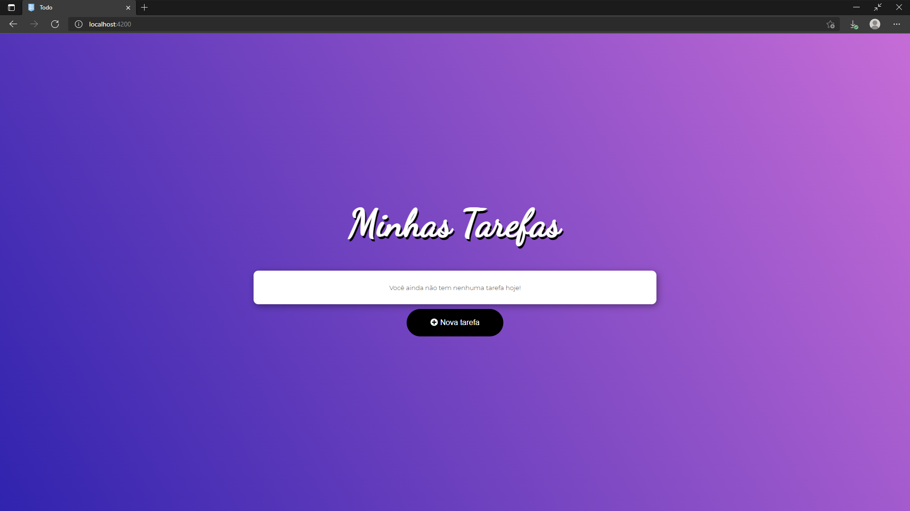

# Todo-list simples

>Projeto simples feito em angular voltado a estudo.

## Interface principal



## Requisitos
* Node
* Angular

## Como executar o projeto localmente
#### Clonar projeto
```bash
git clone https://github.com/renan-f/todo-list-angular
````
#### Instalar dependências
```bash
npm install
```

#### Iniciar servidor
```bash
ng serve
````